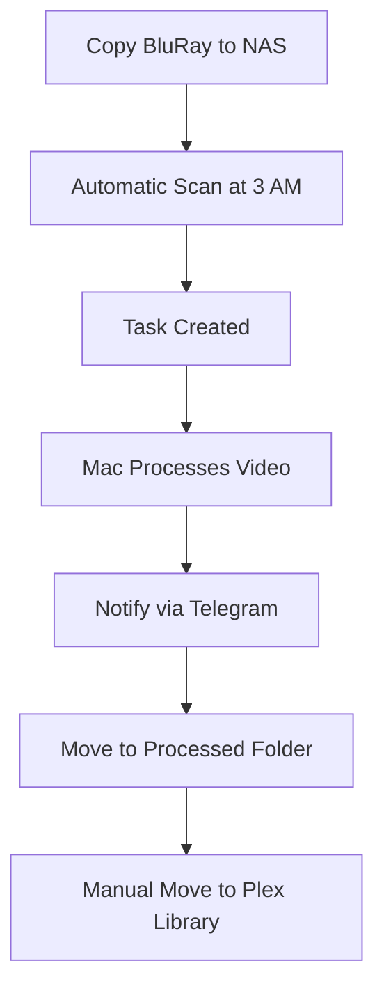

# BluRay Converter - User Guide

Complete guide for daily operations of the BluRay Converter system.

## Table of Contents

1. [Daily Workflow](#daily-workflow)
2. [Web Interface](#web-interface)
3. [Adding Movies](#adding-movies)
4. [Monitoring Progress](#monitoring-progress)
5. [Managing Tasks](#managing-tasks)
6. [Telegram Integration](#telegram-integration)
7. [API Usage](#api-usage)
8. [File Management](#file-management)
9. [System Maintenance](#system-maintenance)
10. [Best Practices](#best-practices)

## Daily Workflow

### Typical User Workflow



### 1. Add New Movies
Place BluRay folders in the raw directory:
```
/volume1/video/Кино/BluRayRAW/
└── New Movie (2023)/
    └── BDMV/
        ├── PLAYLIST/
        ├── STREAM/
        └── CLIPINF/
```

### 2. Automatic Processing
- System scans daily at 3 AM (configurable)
- New movies are automatically detected
- Processing starts on Mac mini
- Progress notifications via Telegram

### 3. Manual Intervention
- Check Web UI for status
- Move completed files to Plex library
- Monitor for any errors

## Web Interface

Access the web interface at: `http://your-nas-ip:8081`

### Dashboard Overview
- **Task Queue**: Current and pending tasks
- **System Status**: Health of all services
- **Statistics**: Processing history and stats
- **Recent Activity**: Latest operations

### Main Features

#### Task Management
- View all tasks with status
- Restart failed tasks
- Set task priorities
- Cancel running tasks

#### Manual Controls
- **Scan Directory**: Trigger immediate scan
- **Process Queue**: Force processing start
- **Clear Completed**: Remove finished tasks

#### System Information
- Service health status
- Resource usage
- Recent error logs
- System configuration

## Adding Movies

### Supported Formats
The system processes BluRay disc images with this structure:
```
Movie Name (Year)/
└── BDMV/
    ├── PLAYLIST/
    │   ├── 00000.mpls  # Menu playlist
    │   ├── 00001.mpls  # Main movie (longest)
    │   └── 00002.mpls  # Extras
    ├── STREAM/
    │   ├── 00000.m2ts  # Video streams
    │   └── 00001.m2ts
    └── CLIPINF/
        ├── 00000.clpi  # Clip info
        └── 00001.clpi
```

### File Naming Conventions
Use clear, descriptive names:
- ✅ `The Matrix (1999)`
- ✅ `Blade Runner 2049 (2017)`
- ❌ `movie1`
- ❌ `BluRay_Backup`

### Directory Structure
```
/volume1/video/Кино/
├── BluRayRAW/          # Drop new movies here
│   ├── Movie A (2023)/
│   └── Movie B (2022)/
├── BluRayProcessed/    # System outputs here
│   ├── Movie A (2023).mkv
│   └── Movie B (2022).mkv
└── BluRayTemp/         # Temporary processing
    └── (automatic cleanup)
```

## Monitoring Progress

### Web Interface Monitoring
1. Open `http://your-nas-ip:8081`
2. Check the **Tasks** section
3. Monitor **Status** column:
   - 🟡 **Pending**: Waiting to be processed
   - 🔵 **Sent**: Sent to Mac mini
   - 🟠 **Processing**: Currently converting
   - 🟢 **Completed**: Successfully processed
   - 🔴 **Failed**: Error occurred

### Task Details
Click on any task to see:
- Processing start/end times
- Current progress percentage
- Error messages (if failed)
- File sizes and locations

### Real-time Updates
The web interface updates automatically every 30 seconds.

## Managing Tasks

### Task Statuses
- **pending**: Waiting in queue
- **sent**: Dispatched to worker
- **processing**: Currently being converted
- **completed**: Successfully finished
- **failed**: Error occurred
- **retrying**: Automatic retry in progress

### Task Actions

#### Restart Failed Tasks
1. Navigate to failed task
2. Click **Restart** button
3. Task returns to **pending** status

#### Priority Processing
1. Select important task
2. Click **Set Priority**
3. Task moves to front of queue

#### Cancel Tasks
1. Find running task
2. Click **Cancel**
3. Processing stops, temp files cleaned

### Bulk Operations
- **Restart All Failed**: Retry all failed tasks
- **Clear Completed**: Remove finished tasks from view
- **Scan Directory**: Check for new movies

## Telegram Integration

### Bot Commands
Send these commands to your bot:

#### Information Commands
- `/queue` - Show current task queue
- `/status` - System health status
- `/stats` - Processing statistics
- `/help` - List all commands

#### Control Commands
- `/scan` - Trigger directory scan
- `/cancel` - Cancel current processing
- `/restart <task_id>` - Restart specific task

### Notification Types

#### Processing Started
```
🎬 Processing started: The Matrix (1999)
Worker: Mac mini
Queue position: 1 of 3
```

#### Processing Completed
```
✅ Completed: The Matrix (1999)
Duration: 45 minutes
Output: 12.3 GB MKV file
Location: BluRayProcessed/
```

#### Error Notifications
```
❌ Processing failed: The Matrix (1999)
Error: Invalid BDMV structure
Attempts: 2/3
Next retry: 30 minutes
```

### Notification Settings
Configure in NAS `.env` file:
```bash
TELEGRAM_BOT_TOKEN=your_bot_token
TELEGRAM_CHAT_ID=your_chat_id
TELEGRAM_NOTIFICATIONS=true
```

## API Usage

### Base URLs
- **NAS API**: `http://your-nas-ip:8080/api`
- **Mac Worker**: `http://mac-mini-ip:8000/api`

### Common Endpoints

#### Get All Tasks
```bash
curl http://your-nas-ip:8080/api/tasks
```

#### Trigger Scan
```bash
curl -X POST http://your-nas-ip:8080/api/tasks/scan \
  -H "Content-Type: application/json" \
  -d '{"priority": 1}'
```

#### Check System Health
```bash
curl http://your-nas-ip:8080/api/health
```

#### Get Statistics
```bash
curl http://your-nas-ip:8080/api/statistics
```

#### Restart Task
```bash
curl -X POST http://your-nas-ip:8080/api/tasks/123/restart
```

### Response Formats
All API responses use JSON format:
```json
{
  "status": "success",
  "data": {...},
  "message": "Operation completed"
}
```

## File Management

### Automatic File Operations

#### After Successful Processing
1. **Original**: Moved from `BluRayRAW/` to system backup
2. **Converted**: Placed in `BluRayProcessed/`
3. **Temporary**: Cleaned from `BluRayTemp/`

#### File Naming
Output files follow this pattern:
- Input: `Movie Name (2023)/BDMV/`
- Output: `Movie Name (2023).mkv`

### Manual File Management

#### Moving to Plex Library
After processing, manually move files:
```bash
# Example move to Plex library
mv "/volume1/video/Кино/BluRayProcessed/Movie (2023).mkv" \
   "/volume1/video/Movies/Movie (2023).mkv"
```

#### Cleaning Up
Remove processed originals:
```bash
# Remove original BluRay folder after successful conversion
rm -rf "/volume1/video/Кино/BluRayRAW/Movie (2023)/"
```

### Storage Management

#### Disk Space Monitoring
- Monitor available space regularly
- Each BluRay: ~25-50GB input, ~15-30GB output
- Keep 100GB+ free for processing

#### Automatic Cleanup
System automatically cleans:
- Temporary files after completion
- Database records older than 60 days
- Log files when they exceed size limits

## System Maintenance

### Daily Checks
Via Web UI or API:
- ✅ Service health status
- ✅ Task queue status
- ✅ Available disk space
- ✅ Recent error logs

### Weekly Maintenance
```bash
# Check service status
./scripts/test-connection.sh

# Review logs for issues
./scripts/deploy-nas.sh logs
./scripts/deploy-mac.sh logs
```

### Monthly Tasks
```bash
# Update system
git pull origin main
./scripts/deploy-nas.sh
./scripts/deploy-mac.sh

# Backup configuration
tar -czf config-backup.tar.gz nas-services/.env mac-services/.env
```

### Database Maintenance
Automatic cleanup runs weekly, or trigger manually:
```bash
curl -X POST http://your-nas-ip:8080/api/maintenance/cleanup
```

## Best Practices

### Movie Preparation
1. **Verify BDMV structure** before copying
2. **Use descriptive names** with year
3. **Check available space** before adding
4. **Test with one movie** first

### Monitoring
1. **Check Telegram notifications** regularly
2. **Review Web UI** for failed tasks
3. **Monitor disk space** weekly
4. **Backup configurations** monthly

### Performance Optimization
1. **Process one movie at a time** for stability
2. **Schedule scans during low usage** hours
3. **Keep Mac mini powered on** 24/7
4. **Use wired network connection**

### Troubleshooting
1. **Check connection test** first
2. **Review logs** for errors
3. **Restart services** if needed
4. **Use dry-run mode** for testing

### File Organization
```
Recommended Plex structure:
/volume1/video/Movies/
├── Action/
│   ├── The Matrix (1999).mkv
│   └── John Wick (2014).mkv
├── Drama/
│   └── The Shawshank Redemption (1994).mkv
└── Sci-Fi/
    └── Blade Runner 2049 (2017).mkv
```

## Common Operations

### Adding Multiple Movies
```bash
# Copy multiple BluRay folders to RAW directory
cp -r "/path/to/bluray/Movie1 (2023)" "/volume1/video/Кино/BluRayRAW/"
cp -r "/path/to/bluray/Movie2 (2023)" "/volume1/video/Кино/BluRayRAW/"

# Trigger scan
curl -X POST http://your-nas-ip:8080/api/tasks/scan
```

### Batch Processing
The system processes movies sequentially by default. To view queue:
```bash
# Check processing queue
curl http://your-nas-ip:8080/api/tasks | jq '.data[] | select(.status=="pending")'
```

### Emergency Stop
```bash
# Stop all processing
curl -X POST http://your-nas-ip:8080/api/tasks/cancel-all

# Or restart entire system
./scripts/reset-system.sh containers
./scripts/deploy-nas.sh
./scripts/deploy-mac.sh
```

## Integration with Plex

### Automatic Library Updates
Consider setting up Plex to automatically scan for new content:
1. Enable **Scan my library automatically** in Plex settings
2. Set scan interval to check for new files
3. Monitor Plex logs for successful imports

### Metadata Management
- Use proper movie naming conventions
- Include year in filename for better matching
- Consider using tools like Filebot for organization

---

**Quick Reference**: Keep this guide bookmarked for daily operations. For setup issues, see [SETUP.md](SETUP.md). For problems, check [TROUBLESHOOTING.md](TROUBLESHOOTING.md).