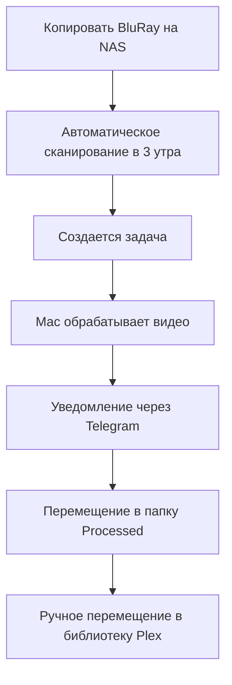

# BluRay Converter - Руководство пользователя

Полное руководство по ежедневному использованию системы BluRay Converter.

## Содержание

1. [Ежедневный рабочий процесс](#ежедневный-рабочий-процесс)
2. [Веб-интерфейс](#веб-интерфейс)
3. [Добавление фильмов](#добавление-фильмов)
4. [Мониторинг прогресса](#мониторинг-прогресса)
5. [Управление задачами](#управление-задачами)
6. [Интеграция с Telegram](#интеграция-с-telegram)
7. [Использование API](#использование-api)
8. [Управление файлами](#управление-файлами)
9. [Обслуживание системы](#обслуживание-системы)
10. [Лучшие практики](#лучшие-практики)

## Ежедневный рабочий процесс

### Типичный рабочий процесс пользователя



### 1. Добавление новых фильмов
Поместите папки BluRay в директорию для сырых файлов:
```
/volume1/video/Кино/BluRayRAW/
└── Новый Фильм (2023)/
    └── BDMV/
        ├── PLAYLIST/
        ├── STREAM/
        └── CLIPINF/
```

### 2. Автоматическая обработка
- Система сканирует ежедневно в 3 утра (настраивается)
- Новые фильмы автоматически обнаруживаются
- Обработка начинается на Mac mini
- Уведомления о прогрессе через Telegram

### 3. Ручное вмешательство
- Проверяйте статус в веб-интерфейсе
- Перемещайте готовые файлы в библиотеку Plex
- Следите за ошибками

## Веб-интерфейс

Доступ к веб-интерфейсу: `http://your-nas-ip:8081`

### Обзор панели управления
- **Очередь задач**: Текущие и ожидающие задачи
- **Статус системы**: Состояние всех сервисов
- **Статистика**: История обработки и статистика
- **Последняя активность**: Последние операции

### Основные функции

#### Управление задачами
- Просмотр всех задач со статусом
- Перезапуск неудачных задач
- Установка приоритетов задач
- Отмена выполняющихся задач

#### Ручное управление
- **Сканировать директорию**: Запуск немедленного сканирования
- **Обработать очередь**: Принудительный запуск обработки
- **Очистить завершенные**: Удаление завершенных задач

#### Информация о системе
- Статус состояния сервисов
- Использование ресурсов
- Последние логи ошибок
- Конфигурация системы

## Добавление фильмов

### Поддерживаемые форматы
Система обрабатывает образы BluRay дисков с такой структурой:
```
Название Фильма (Год)/
└── BDMV/
    ├── PLAYLIST/
    │   ├── 00000.mpls  # Плейлист меню
    │   ├── 00001.mpls  # Основной фильм (самый длинный)
    │   └── 00002.mpls  # Дополнения
    ├── STREAM/
    │   ├── 00000.m2ts  # Видео потоки
    │   └── 00001.m2ts
    └── CLIPINF/
        ├── 00000.clpi  # Информация о клипах
        └── 00001.clpi
```

### Соглашения об именовании файлов
Используйте четкие, описательные имена:
- ✅ `Матрица (1999)`
- ✅ `Бегущий по лезвию 2049 (2017)`
- ❌ `фильм1`
- ❌ `BluRay_Бэкап`

### Структура директорий
```
/volume1/video/Кино/
├── BluRayRAW/          # Помещайте новые фильмы сюда
│   ├── Фильм А (2023)/
│   └── Фильм Б (2022)/
├── BluRayProcessed/    # Система выводит сюда
│   ├── Фильм А (2023).mkv
│   └── Фильм Б (2022).mkv
└── BluRayTemp/         # Временная обработка
    └── (автоматическая очистка)
```

## Мониторинг прогресса

### Мониторинг через веб-интерфейс
1. Откройте `http://your-nas-ip:8081`
2. Проверьте раздел **Задачи**
3. Следите за колонкой **Статус**:
   - 🟡 **Ожидает**: Ждет обработки
   - 🔵 **Отправлено**: Отправлено на Mac mini
   - 🟠 **Обрабатывается**: Сейчас конвертируется
   - 🟢 **Завершено**: Успешно обработано
   - 🔴 **Ошибка**: Произошла ошибка

### Детали задач
Нажмите на любую задачу, чтобы увидеть:
- Время начала/окончания обработки
- Текущий процент прогресса
- Сообщения об ошибках (если неудачно)
- Размеры файлов и местоположения

### Обновления в реальном времени
Веб-интерфейс автоматически обновляется каждые 30 секунд.

## Управление задачами

### Статусы задач
- **ожидает**: Ждет в очереди
- **отправлено**: Отправлено worker'у
- **обрабатывается**: Сейчас конвертируется
- **завершено**: Успешно завершено
- **ошибка**: Произошла ошибка
- **повторяется**: Автоматический повтор в процессе

### Действия с задачами

#### Перезапуск неудачных задач
1. Перейдите к неудачной задаче
2. Нажмите кнопку **Перезапустить**
3. Задача возвращается в статус **ожидает**

#### Приоритетная обработка
1. Выберите важную задачу
2. Нажмите **Установить приоритет**
3. Задача перемещается в начало очереди

#### Отмена задач
1. Найдите выполняющуюся задачу
2. Нажмите **Отменить**
3. Обработка останавливается, временные файлы очищаются

### Массовые операции
- **Перезапустить все неудачные**: Повторить все неудачные задачи
- **Очистить завершенные**: Удалить завершенные задачи из вида
- **Сканировать директорию**: Проверить новые фильмы

## Интеграция с Telegram

### Команды бота
Отправьте эти команды вашему боту:

#### Информационные команды
- `/queue` - Показать текущую очередь задач
- `/status` - Статус состояния системы
- `/stats` - Статистика обработки
- `/help` - Список всех команд

#### Команды управления
- `/scan` - Запустить сканирование директории
- `/cancel` - Отменить текущую обработку
- `/restart <task_id>` - Перезапустить конкретную задачу

### Типы уведомлений

#### Обработка начата
```
🎬 Начата обработка: Матрица (1999)
Worker: Mac mini
Позиция в очереди: 1 из 3
```

#### Обработка завершена
```
✅ Завершено: Матрица (1999)
Длительность: 45 минут
Выход: MKV файл 12.3 GB
Местоположение: BluRayProcessed/
```

#### Уведомления об ошибках
```
❌ Ошибка обработки: Матрица (1999)
Ошибка: Неверная структура BDMV
Попытки: 2/3
Следующий повтор: через 30 минут
```

### Настройки уведомлений
Настройте в файле `.env` NAS:
```bash
TELEGRAM_BOT_TOKEN=ваш_токен_бота
TELEGRAM_CHAT_ID=ваш_chat_id
TELEGRAM_NOTIFICATIONS=true
```

## Использование API

### Базовые URL
- **NAS API**: `http://your-nas-ip:8080/api`
- **Mac Worker**: `http://mac-mini-ip:8000/api`

### Общие endpoints

#### Получить все задачи
```bash
curl http://your-nas-ip:8080/api/tasks
```

#### Запустить сканирование
```bash
curl -X POST http://your-nas-ip:8080/api/tasks/scan \
  -H "Content-Type: application/json" \
  -d '{"priority": 1}'
```

#### Проверить состояние системы
```bash
curl http://your-nas-ip:8080/api/health
```

#### Получить статистику
```bash
curl http://your-nas-ip:8080/api/statistics
```

#### Перезапустить задачу
```bash
curl -X POST http://your-nas-ip:8080/api/tasks/123/restart
```

### Форматы ответов
Все API ответы используют JSON формат:
```json
{
  "status": "success",
  "data": {...},
  "message": "Операция завершена"
}
```

## Управление файлами

### Автоматические файловые операции

#### После успешной обработки
1. **Оригинал**: Перемещен из `BluRayRAW/` в системный бэкап
2. **Конвертированный**: Помещен в `BluRayProcessed/`
3. **Временный**: Очищен из `BluRayTemp/`

#### Именование файлов
Выходные файлы следуют этому шаблону:
- Вход: `Название Фильма (2023)/BDMV/`
- Выход: `Название Фильма (2023).mkv`

### Ручное управление файлами

#### Перемещение в библиотеку Plex
После обработки вручную переместите файлы:
```bash
# Пример перемещения в библиотеку Plex
mv "/volume1/video/Кино/BluRayProcessed/Фильм (2023).mkv" \
   "/volume1/video/Movies/Фильм (2023).mkv"
```

#### Очистка
Удалите обработанные оригиналы:
```bash
# Удалите оригинальную папку BluRay после успешной конвертации
rm -rf "/volume1/video/Кино/BluRayRAW/Фильм (2023)/"
```

### Управление хранилищем

#### Мониторинг дискового пространства
- Регулярно контролируйте доступное место
- Каждый BluRay: ~25-50GB вход, ~15-30GB выход
- Держите 100GB+ свободными для обработки

#### Автоматическая очистка
Система автоматически очищает:
- Временные файлы после завершения
- Записи базы данных старше 60 дней
- Файлы логов при превышении лимитов размера

## Обслуживание системы

### Ежедневные проверки
Через веб-интерфейс или API:
- ✅ Статус состояния сервисов
- ✅ Статус очереди задач
- ✅ Доступное дисковое пространство
- ✅ Последние логи ошибок

### Еженедельное обслуживание
```bash
# Проверить статус сервисов
./scripts/test-connection.sh

# Просмотреть логи на предмет проблем
./scripts/deploy-nas.sh logs
./scripts/deploy-mac.sh logs
```

### Ежемесячные задачи
```bash
# Обновить систему
git pull origin main
./scripts/deploy-nas.sh
./scripts/deploy-mac.sh

# Резервное копирование конфигурации
tar -czf config-backup.tar.gz nas-services/.env mac-services/.env
```

### Обслуживание базы данных
Автоматическая очистка запускается еженедельно, или запустите вручную:
```bash
curl -X POST http://your-nas-ip:8080/api/maintenance/cleanup
```

## Лучшие практики

### Подготовка фильмов
1. **Проверьте структуру BDMV** перед копированием
2. **Используйте описательные имена** с годом
3. **Проверьте доступное место** перед добавлением
4. **Протестируйте с одним фильмом** сначала

### Мониторинг
1. **Проверяйте уведомления Telegram** регулярно
2. **Просматривайте веб-интерфейс** на предмет неудачных задач
3. **Контролируйте дисковое пространство** еженедельно
4. **Делайте резервные копии конфигураций** ежемесячно

### Оптимизация производительности
1. **Обрабатывайте по одному фильму** для стабильности
2. **Планируйте сканирования в часы низкой нагрузки**
3. **Держите Mac mini включенным** 24/7
4. **Используйте проводное сетевое подключение**

### Решение проблем
1. **Сначала проверьте тест подключения**
2. **Просмотрите логи** на предмет ошибок
3. **Перезапустите сервисы** при необходимости
4. **Используйте режим сухого прогона** для тестирования

### Организация файлов
```
Рекомендуемая структура Plex:
/volume1/video/Movies/
├── Боевики/
│   ├── Матрица (1999).mkv
│   └── Джон Уик (2014).mkv
├── Драмы/
│   └── Побег из Шоушенка (1994).mkv
└── Научная фантастика/
    └── Бегущий по лезвию 2049 (2017).mkv
```

## Общие операции

### Добавление нескольких фильмов
```bash
# Копирование нескольких папок BluRay в директорию RAW
cp -r "/путь/к/bluray/Фильм1 (2023)" "/volume1/video/Кино/BluRayRAW/"
cp -r "/путь/к/bluray/Фильм2 (2023)" "/volume1/video/Кино/BluRayRAW/"

# Запустить сканирование
curl -X POST http://your-nas-ip:8080/api/tasks/scan
```

### Пакетная обработка
Система обрабатывает фильмы последовательно по умолчанию. Для просмотра очереди:
```bash
# Проверить очередь обработки
curl http://your-nas-ip:8080/api/tasks | jq '.data[] | select(.status=="pending")'
```

### Экстренная остановка
```bash
# Остановить всю обработку
curl -X POST http://your-nas-ip:8080/api/tasks/cancel-all

# Или перезапустить всю систему
./scripts/reset-system.sh containers
./scripts/deploy-nas.sh
./scripts/deploy-mac.sh
```

## Интеграция с Plex

### Автоматические обновления библиотеки
Рассмотрите настройку Plex для автоматического сканирования нового контента:
1. Включите **Сканировать мою библиотеку автоматически** в настройках Plex
2. Установите интервал сканирования для проверки новых файлов
3. Контролируйте логи Plex на предмет успешных импортов

### Управление метаданными
- Используйте правильные соглашения об именовании фильмов
- Включайте год в имя файла для лучшего сопоставления
- Рассмотрите использование инструментов типа Filebot для организации

---

**Быстрая справка**: Сохраните это руководство в закладках для ежедневных операций. Для проблем с установкой см. [SETUP.md](SETUP.md). Для проблем проверьте [TROUBLESHOOTING.md](TROUBLESHOOTING.md).